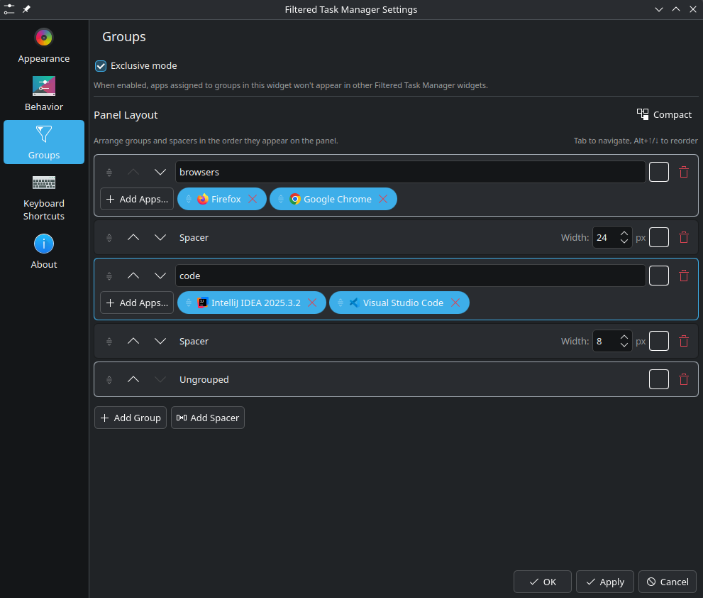

# Filtered Task Manager

A KDE Plasma 6 panel widget that extends the default Icons-Only Task Manager with **app sections**, **colored sections**, and **spacers** — giving you full control over how your taskbar is organized.



## Features

- **App Sections** — Create named sections and assign apps to them. Each section becomes a distinct area on your panel.
- **Color-Coded Sections** — Set a background color per section so you can visually distinguish them at a glance.
- **Spacers** — Add spacers between sections with configurable pixel widths to control spacing.
- **Unsectioned** — A catch-all section for apps not assigned to any section. Can be positioned anywhere in the layout.
- **Drag-and-Drop Reordering** — Drag sections and spacers to rearrange your panel layout. Drag app chips between sections to reassign them.
- **Keyboard Navigation** — Arrow keys to navigate between cards, Alt+Up/Down to reorder. Focus indicator shows which card is selected.
- **Compact View** — Toggle a collapsed view for easier reordering when you have many sections.
- **Exclusive Mode** — Prevent sectioned apps from appearing in other Filtered Task Manager instances on the same panel.
- **Undo Delete** — Accidentally delete a section? A toast appears with an Undo button for 5 seconds.
- **App Picker** — Searchable list of all installed applications for easy section assignment.

## Tested On

- **KDE Plasma 6.5.5**
- **Plasma API minimum version: 6.0**

This widget is a fork of the stock KDE Plasma Icons-Only Task Manager.

## Installation

### Build from source

Requires KDE Plasma 6 development packages (ECM, Plasma, KF6, etc.).

```bash
git clone https://github.com/aaronkirschen/plasma-filteredtasks.git
cd plasma-filteredtasks
mkdir build && cd build
cmake .. -DCMAKE_INSTALL_PREFIX=/usr
make -j$(nproc)
sudo make install
```

Then restart plasmashell:

```bash
plasmashell --replace &
```

### Adding to Your Panel

1. Right-click your panel → **Add Widgets...**
2. Search for **Filtered Task Manager**
3. Drag it onto your panel
4. Right-click the widget → **Configure Filtered Tasks Manager...** to set up sections

### Uninstall

From the build directory:

```bash
sudo make uninstall
plasmashell --replace &
```

## Configuration

Right-click the widget on your panel and choose **Configure...** → **Sections** tab.

- **Add Section** — Creates a new named section. Click "Add Apps..." to assign applications.
- **Add Spacer** — Inserts a spacer with configurable width (in pixels).
- **Add Unsectioned** — Adds the catch-all section for unassigned apps.
- **Reorder** — Drag the handle on the left, use the arrow buttons, or press Alt+Up/Down. Arrow keys navigate between cards.
- **Color** — Click the color swatch on any card to set a background color.
- **Move Apps** — Drag app chips from one section to another.
- **Compact View** — Click the Compact/Expand toggle to collapse cards for easier sorting.

## License

GPL-2.0-or-later. Based on the KDE Plasma Task Manager by Eike Hein.
